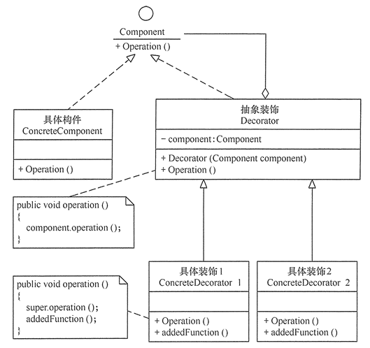

## 装饰者模式（Decorator）
> 指在不改变现有对象结构的情况下，动态地给该对象增加一些职责（即增加其额外功能）的模式，它属于对象结构型模式。

### 1.优缺点
**优点：**
1. 装饰器是继承的有力补充，比继承灵活，在不改变原有对象的情况下，动态的给一个对象扩展功能，即插即用
2. 通过使用不用装饰类及这些装饰类的排列组合，可以实现不同效果
3. 装饰器模式完全遵守开闭原则

**缺点：**
1. 装饰器模式会增加许多子类，过度使用会增加程序得复杂性。

### 2.结构
装饰器模式主要包含以下角色：
1. 抽象构件（Component）角色：定义一个抽象接口以规范准备接收附加责任的对象。
2. 具体构件（ConcreteComponent）角色：实现抽象构件，通过装饰角色为其添加一些职责。
3. 抽象装饰（Decorator）角色：继承抽象构件，并包含具体构件的实例，可以通过其子类扩展具体构件的功能。
4. 具体装饰（ConcreteDecorator）角色：实现抽象装饰的相关方法，并给具体构件对象添加附加的责任。

结构图

