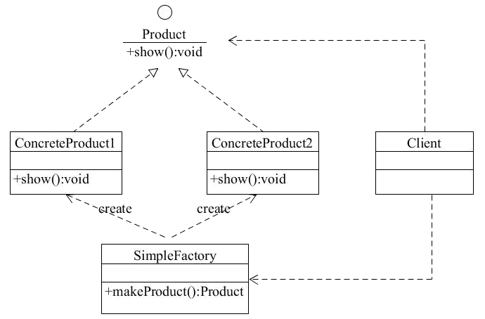

## 1.简单工厂模式
> 定义一个创建产品对象的工厂接口，将产品对象的实际创建工作推迟到具体子工厂类当中。这满足创建型模式中所要求的“创建与使用相分离”的特点。

### 1.1 优缺点
**优点：**

 1. 工厂类含有必要的判断逻辑，可以决定在什么时候创建哪一个产品类的实例，客户端可以免除直接创建产品对象的责任，而仅仅“消费”产品；简单工厂模式通过这种做法实现了对责任的分割，它提供了专门的工厂类用于创建对象。
 2. 客户端无须知道所创建的具体产品类的类名，只需要知道具体产品类所对应的参数即可，对于一些复杂的类名，通过简单工厂模式可以减少使用者的记忆量。
 3. 通过引入配置文件，可以在不修改任何客户端代码的情况下更换和增加新的具体产品类，在一定程度上提高了系统的灵活性。

**缺点：**

1. 由于工厂类集中了所有产品创建逻辑，一旦不能正常工作，整个系统都要受到影响。
2. 使用简单工厂模式将会增加系统中类的个数，在一定程序上增加了系统的复杂度和理解难度。
3. 系统扩展困难，一旦添加新产品就不得不修改工厂逻辑，同样破坏了“开闭原则”；在产品类型较多时，有可能造成工厂逻辑过于复杂，不利于系统的扩展和维护。
4. 简单工厂模式由于使用了静态工厂方法，造成工厂角色无法形成基于继承的等级结构。

### 1.2 结构
简单工厂模式的主要角色如下： 
* 简单工厂（SimpleFactory）：是简单工厂模式的核心，负责实现创建所有实例的内部逻辑。工厂类的创建产品类的方法可以被外界直接调用，创建所需的产品对象。
* 抽象产品（Product）：是简单工厂创建的所有对象的父类，负责描述所有实例共有的公共接口。
* 具体产品（ConcreteProduct）：是简单工厂模式的创建目标。

结构图
* 

### 2.工厂方法模式

  定义一个用于创建对象的接口，让子类决定实例化哪一个类。工厂方法使一个类的实例化延迟到其子类。

**优点：**

> 1. 用户只需要知道具体工厂的名称就可得到所要的产品，无须知道产品的具体创建过程。
> 2. 灵活性增强，对于新产品的创建，只需多写一个相应的工厂类。
> 3. 典型的解耦框架。高层模块只需要知道产品的抽象类，无须关心其他实现类，满足迪米特法则、依赖倒置原则和里氏替换原则。

**缺点：**

> 1. 类的个数容易过多，增加复杂度
> 2. 增加了系统的抽象性和理解难度
> 3. 抽象产品只能生产一种产品，此弊端可使用抽象工厂模式解决。
>    

### 3.抽象工厂模式

  是一种为访问类提供一个创建一组相关或相互依赖对象的接口，且访问类无须指定所要产品的具体类就能得到同族的不同等级的产品的模式结构。

**优点：**

> 1. 可以在类的内部对产品族中相关联的多等级产品共同管理，而不必专门引入多个新的类来进行管理。
> 2. 当需要产品族时，抽象工厂可以保证客户端始终只使用同一个产品的产品组。
> 3. 抽象工厂增强了程序的可扩展性，当增加一个新的产品族时，不需要修改原代码，满足开闭原则。

**缺点：**

1. > 当产品族中需要增加一个新的产品时，所有的工厂类都需要进行修改。增加了系统的抽象性和理解难度。